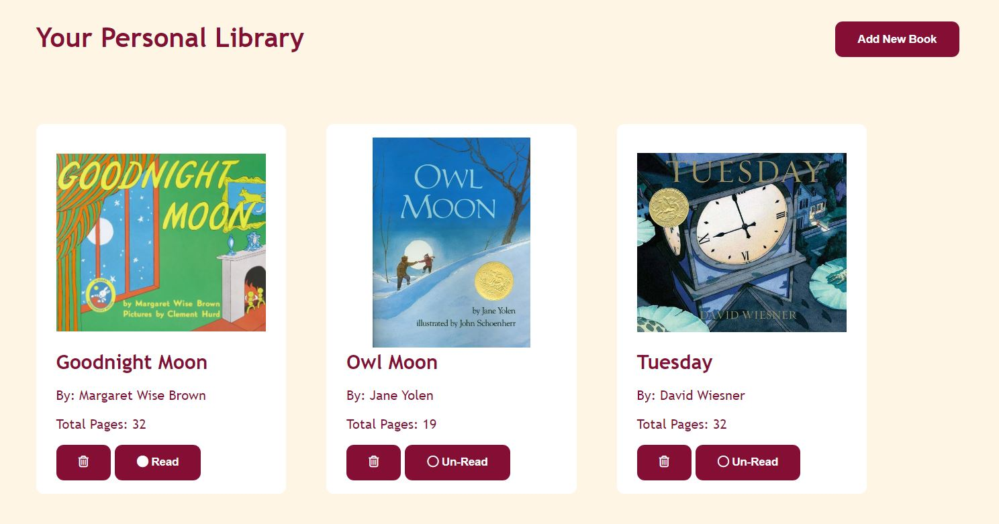

# Library

This project is from [the Odin Project](https://www.theodinproject.com/lessons/node-path-javascript-library)

## Table of contents
- [Overview](#overview)
  - [The challenge](#the-challenge)
  - [Screenshot](#screenshot)
  - [Live URL](#live-url)
-[My process](#my-process)
  - [What I Learned](#what-i-learned)
  - [Technologies Used](#technologies-used)
- [Attribution](#attribution)

## Overview
This project is a personal library where various books are stored and displayed

### The challenge
This application should have the following functionalities:
- Allow user to add books
- Display the books information (i.e. title, author, cover image, total pages and reading status) in a table or card format
- Allow user to change reading status to read or un-read 
- Allow user to delete books 

## Screenshot

## Live URL
- Live Site URL: [Live Link](https://hamnaishaq.github.io/library/)

## My process
On page load, the library is empty and, as a result, no book is shown. User can add a new book by using the 'Add New Book' button. A modal is opened on clicking this button which contains a form to fill book information. The user can then add the book information; title, author, total pages, cover image URL and current reading status, in the modal form. 

JavaScript constuctor function is used to create books which are then displayed to the screen in the cards. By clicking the trash icon in the book card, the clicked book can be deleted from the library. The reading status can be changed by just clicking the current reading status shown on the book card.

### What I learned
I learned what constuctor functions are and when we need to use them. I leant how to use JavaScript contructors in a practical situation. 
I also learnt how to make a custom modal using vanilla CSS.

### Technologies used
- HTML
- CSS
- JS

## Attribution

- Favicon <a href="https://www.flaticon.com/free-icons/book" title="book icons">book icons created by Freepik - Flaticon</a>
- Empty Library Image <a href="http://www.freepik.com">Designed by slidesgo / Freepik</a>
